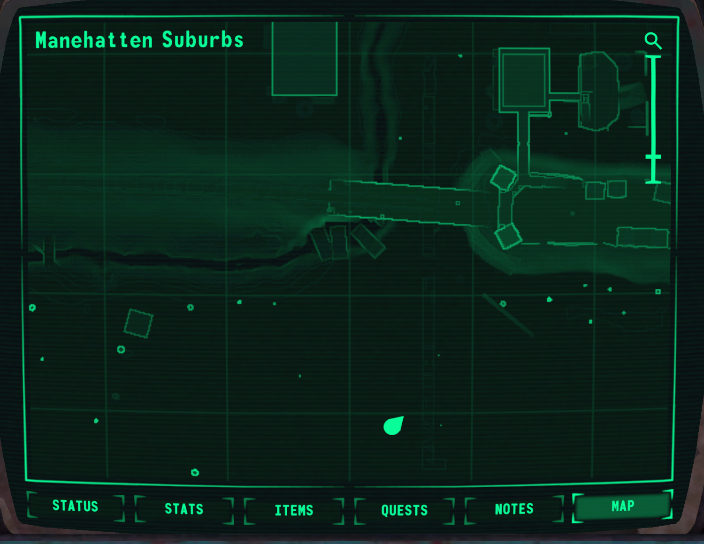

In this post you will find out what is Megaspell and how it came to be, what's done and what is in development.
But first, we present to you a gameplay trailer.

<iframe width="560" height="315" src="https://www.youtube.com/embed/DdaBoSXX5ck" title="YouTube video player" frameborder="0" allow="accelerometer; autoplay; clipboard-write; encrypted-media; gyroscope; picture-in-picture; web-share" allowfullscreen></iframe>

<!-- end -->

# What is Megaspell?

Megaspell can be described as Alien Shooter if it was a pony RPG. From Alien Shooter here is the camera positioning, character control and shooting. RPG elements came from Fallout - SPECIAL, skills, traits. Up-to 20 players can play together in the world of post-apocalyptic Equestria.

Although small tests happened since 2019, actual development began in the summer of 2021, reaching full pace in spring 2023. Approximately ⅔ of all work was done in the last 6 months. The original plan to make a 2D side-scroller based on Remains first turned into 2D isometric, and then into full-fledged 3D with a top-down view.

So far our team is duo: Shimmermare - organization and code, and dacaoo - art. We recognize that we don't have the ability to capture the player's attention with detailed locations or deep story, so the focus is on gameplay, style and feels. Assets play a secondary role, which results in stuff like using SFM rigs, free or store-bought assets, with some custom assets here and there. Players won't notice weapons having human grips if they are having fun.

Now that the core of the game is ready, we are ready for the first public release. We'll be releasing a Death Match demo by mid-November. This demo will include:
- Gameplay core with PvPvE combat.
- One level for DM.
- Public servers.

We expect that this will help us find bugs, confirm or deny our assumptions, and attract people to grow the development team.

After this there will be regular releases for each new feature; we see no point in accumulating changes.

## Game modes
For now, we're focused on 2 game modes:
- Death Match - random spawn with selected loadout, find loot, hunt players or NPCs. The mode was chosen because it allows for quick testing and can be left running 24/7 for network component tests.
- Story Mode is the main mode. IT requires content way more than features. This is where we need help: with the script, with level design, with 3D art.

Also, if there is interest, it is possible to create a RP game mode, where tools for managing the world will be available, you can roll dice, etc

# Implemented features

## Multiplayer / COOP

Game has client/server architecture, i.e. even when playing alone a local server is created. This means that all game mechanics natively support multiplayer.
In the case of story mode, player story progression is synchronized with the host's, and their profiles are also stored in host's game save. You may have seen similar feature in Borderlands.

The maximum number of players is limited only by server performance, but with 20 players there should be no noticeable lag.
Currently, in order for the server to be visible on the external Internet, you need to have a public IP.

## Character editor
In this video, you can see character customization including colors, cutiemark, mane types. For now selection of available models is small, which will be fixed after move to a new rig (see below). And yes, the appearance changes will be instantly visible to other players.
<iframe width="560" height="315" src="https://www.youtube.com/embed/PX85zPfOCAA?si=yfMMA2PP1M06WaXv" title="YouTube video player" frameborder="0" allow="accelerometer; autoplay; clipboard-write; encrypted-media; gyroscope; picture-in-picture; web-share" allowfullscreen></iframe>

## PipBuck
As it customary for FoE, the PipBuck plays a central role - you can check current character status, see stats, manage your inventory, and study the map.

### Status

#### Health, mana, and action points
Mana is used to cast spells, AP is used for sprinting and S.A.T.S. HP/MP/AP are passively regenerated, the speed depends on character parameters.

#### Effects
Effects are temporary modifiers that can be added to a character. They work like in Minecraft - there are positive and negative effects, effects of the same type merge. Consumables (food, medicine) are their main source.

### Attributes, skills, traits

#### SPECIAL
The attributes are unchanged from original games, this acronym is too cool to break.

#### Skills
Skills are slightly changed relative to FNV. Energy weapons have been renamed to Magic weapons, the Survival skill has been replaced by Potions, and the Telekinesis skill has been added.

#### Traits / Perks
Same as in FNV, traits can have more than one level and be negative.

<iframe width="560" height="315" src="https://www.youtube.com/embed/_c-IGB5ZFjU?si=4845OcXnlty4UC_5" title="YouTube video player" frameborder="0" allow="accelerometer; autoplay; clipboard-write; encrypted-media; gyroscope; picture-in-picture; web-share" allowfullscreen></iframe>

### Items and equipment
For those who are familiar with Minecraft, the concept of an item is identical - the type, properties and quantity form a stack. An example of a property is weapon condition.
Inventory has no slots and is limited only by carry weight; stacks with the same type and properties are combined.

### Equipment
There are 5 equipment slots: Head, Eyes, Mouth, Neck and Body, and there is a separate hand/hoof slot. Apparel can use more than one slot at a time. For example, you can wear a hat, glasses and a respirator at the same time, OR one full-face helmet.
There are 9 types of damage, and clothing may provide different protection from each damage type.

### Level map
The game world consists of individual locations, and you can travel between them on a global map. Locations can consist of more than one level.
The level size is limited to 1024x1024 meters. Only one level can be loaded at a time; to move to another level, all players must be at the transition zone.

PipBuck has an autogenerated level map function, where you can see your position and points of interest.s

## Combat system
Fast combat with the need to constantly move. You can expect to fight 3-10 NPCs at once.
<iframe width="560" height="315" src="https://www.youtube.com/embed/5nADJwlJ7GA?si=OXuCzEcieD79g8rI" title="YouTube video player" frameborder="0" allow="accelerometer; autoplay; clipboard-write; encrypted-media; gyroscope; picture-in-picture; web-share" allowfullscreen></iframe>

### Weapons
Guns and magical weapons are divided into instant (bullets, rays) and physical (missiles, plasma) projectile types. There are ammo types for different situations, most common is AP ammo.  
Unarmed combat is not planned, but melee weapons are just as fun to use.  
<iframe width="560" height="315" src="https://www.youtube.com/embed/PXQR6iA-m0k?si=aT85Fyz_XolBMlDe" title="YouTube video player" frameborder="0" allow="accelerometer; autoplay; clipboard-write; encrypted-media; gyroscope; picture-in-picture; web-share" allowfullscreen></iframe>

### Magic

#### Spells
Spells can be defensive or offensive. To cast a spell you'll  need a scroll (not consumed) and some mana.
<iframe width="560" height="315" src="https://www.youtube.com/embed/k3ElhXqcrzQ?si=7XITHIPDx54AdPWr" title="YouTube video player" frameborder="0" allow="accelerometer; autoplay; clipboard-write; encrypted-media; gyroscope; picture-in-picture; web-share" allowfullscreen></iframe>

### Damage model
The damage model is based on balance of two parameters: attacker's damage level and attacked's protection. These parameters are affected by equipment and its condition, active effects, perks, and other modifiers.

### AI
For NPC AI a GOAP implementation is used, which in the future makes it possible to make AI of arbitrary complexity, but for now NPCs have simple aggressive AI.

### Fog of war
Characters outside the player's line of sight are hidden and objects are darkened. The strength of the shadow depends on the ambient lighting level. On the surface during the day it is partial shade, and at night or underground it is pitch black darkness.
<iframe width="560" height="315" src="https://www.youtube.com/embed/Gj9s72h7T-I?si=8gly3mZbnqk38pqO" title="YouTube video player" frameborder="0" allow="accelerometer; autoplay; clipboard-write; encrypted-media; gyroscope; picture-in-picture; web-share" allowfullscreen></iframe>

### Reputation
The game has factions and a reputation system. So far it is quite primitive: killing faction members lowers reputation with said faction, friendly NPCs come to the aid for each other.

# In development or in plans
There are nearly a hundred tasks on GitHub; there is simply not enough space to list everything. Below is a selection of interesting tasks.

## S.A.T.S
Or, more accurately, it's second part, as first part with the display of available world interactions is already implemented.
There were a lot of discussions on implementation, as multiplayer brings its own limitations. One of the options is guaranteed criticals during the duration of S.A.T.S

## EFS
The greenest and redst stripes are an interesting challenge for the UI designer because of the top-down camera.

## Leveling
Standard leveling from original games, but with a twist: points for leveling up skills or conditions can be accumulated and used at any time. No need to choose on the spot.

## Environmental threats

### Magic radiation
Everything is standard here. In certain zones the counter starts ticking. The more RADs are accumulated, the lower the max HP, and the more negative effects.

### Taint / I.M.P.
Current idea is to make it a hidden counter. As it grows, random mutations will be added, including positive mutations. As the level of corruption increases, the chance of positive mutations will decrease and the chance of negative mutations will increase. If you're lucky, you can collect a streak of positive mutations. It is impossible to be partially cured; when cured, all mutations will disappear. This will encourage the player to play it safe if they have a good set of mutations.

## Repair
Currently, items have condition but no way to repair them. The plan is to bring repair system from main games.

## New pony rig, races, battle saddles
Game uses an old version of the SFM rig, which is also customized in a way that makes animations incompatible. The plan is to switch to v6 rig and add all available body/color/mane/tail/clothing/etc models to the game.
After this, it will be possible to add other pony races and battle saddles.

## Network play via Steam
Most people don't have access to public IPs, so adding Steamworks is very important. This will allow you to host a server without any additional actions, and other Steam features such as connecting through a friends list will also come in handy.
**IMPORTANT: this does not mean that the game will be released on Steam! Valve allows you to use Steamworks with no game in their store.**

## Potionmaking
Potions play the role of journals from FNV - temporary buffs to character parameters. The process of creating potions has not yet been worked out, but it will definitely be a mini-game, and not a list of recipes with a button. Whenever general crafting system is needed is an open question.

## Lockpicking
I would like to come up with a more interesting mini-game than the one from F3.

## Terminals
Standard Fallout terminals. Except, perhaps, for the hacking mini-game, which I want to make more fun.

## Quest and dialogue systems
Required for the story mode. The systems are required to work in COOP and be customizable so that quest designer can implement their ideas without writing a single line of code.

## Traveling on the global map and random encounters
Just like in Fallout 1/2. The global map is divided into zones with their own random encounters and environment. When players find themselves in a random encounter, an environment is selected from the available ones and all encounters participants spawn in it.

# We need help
We really need help with level design, narrative, and 3D art. But we will not refuse any other help.
If you are ready to help for free, that’s great, but we understand that this is often impossible, so we don’t mind making commissions for complex work.

## Level design
At the moment this is the biggest problem. Designing a level requires a lot of time and imagination, which we don’t have. In order to create a level, you need to draw a terrain, place prefabs, and if there are no suitable prefabs, replace them with temporary grayboxes. All this is done inside the engine and does not require knowledge of programming.

## Narrative and text
Plot, descriptions of items, notes, dialogues. It seems simple from the outside, until you try to write a coherent story. Technically all this can be done in a text file, but if you use the engine you can immediately see the result.

## 3D art
Most of the models can be found for free or on marketplaces, but when you need something pony-specific there are no other options other than making your own. Thanks to the camera's distance, models can be rough and still look good, so it's perfect for beginners.

## Sound
Our sound work looks like “move sliders until it sounds ok”. We would like to have a person who can tell us when something is wrong or how to achieve certain effects.

## 2D art
There is no urgent need for this now, but you can help dacaoo with item icons and other illustrations.

## Localization
We provide English and Russian by default. If someone wants to add a new localization, then this is quite simple and can be done without leaving Google Sheets.

## Code
Unity uses a C# implementation roughly equivalent to C# 9 / .NET Standard 2.1. There is also a backend that uses Java+Spring, and in the future there will be a frontend. If any of this interests you, you are welcome. But I must warn you so that there are no misunderstandings, there will be no code commissions.

# Technical information
The engine used is Unity 2023 \w URP.

## Minimum requirements
For stable 30 FPS and average 50 FPS, a PC from 2011 is enough:
CPU Intel i7-2600, GPU GTX550 1Gb, 8 GB RAM

# A few words about monetization and licensing
**The game is completely free, there are no plans for monetization.**
The only acceptable option for us is raising money for specific commissions.

## Project licensing
Game code, as in everything we coded ourselves will be available to everyone under the GNU GPL3 license.
Custom assets, whenever possible, will be available under CC-BY-SA 4.0

Unfortunately, we cannot publish the entire project files, because:
- Licensed 3rd party plugins are used.
- The purchase of assets most often does not give the right to distribute them.

## Using 3rd party IP
We avoid including assets that we do not have rights to in the project. Yes, it would be much easier to fill the levels by simply pulling models from Bethesda games, and most likely they wouldn't care, but we just don’t want to mess with that. Currently in the game there are several models in use that, although not ripped from Fallout, copy the designs a little too well. For example, the PipBuck. The plan is to replace all such models with custom ones.

Concepts and ideas, for example SPECIAL, will still be used because the probability of legal problems is negligible.

## Mods
Game architecture is built in such a way as not decrease modding potential. However, explicit mod support is not planned at the moment. Mod developers are encouraged to request access and fork the game, under the condition that 3rd party licensed resources will not be distributed in violation of licenses. Better yet, join the team and add your ideas to the main version :)

A few words about localization: language files will be available on Google Sheets, and if anyone wants to add a new localization / be a translator of an existing one, just write us.

# Forecasts for the future

## Positive scenario
We managed to get help with level design, narrative and 3D art. After the release of DM, we shift our focus to supporting the development of the storymode.
In this case, in the next 6 months you will be able to play the beginning of the story mode.

## Realistic scenario
We were able to get some help, but it wasn't enough to populate the world with story mode content. In this case, we will focus on procedural content and release a freeplay mode where you can complete autogenerated quests in procedural levels. This will also take at least 6 months.

## Negative scenario
We couldn't get any help, so we're focusing on what we can do - gameplay mechanics, UI, procedural content. In a year or two we will have a freeplay with procedural content on our hands, and maybe then we will be able to find help.

**In any scenario, I, Shimmermare, will not stop development.** To make my level of involvement clear, I left well-paid job to work on Megaspell full time. So in the worst case scenario Megaspell will be a game with a lot of features but no content. 

# Thank you for your attention
Follow the progress on Discord: https://discord.gg/XfXPfz75Rv
