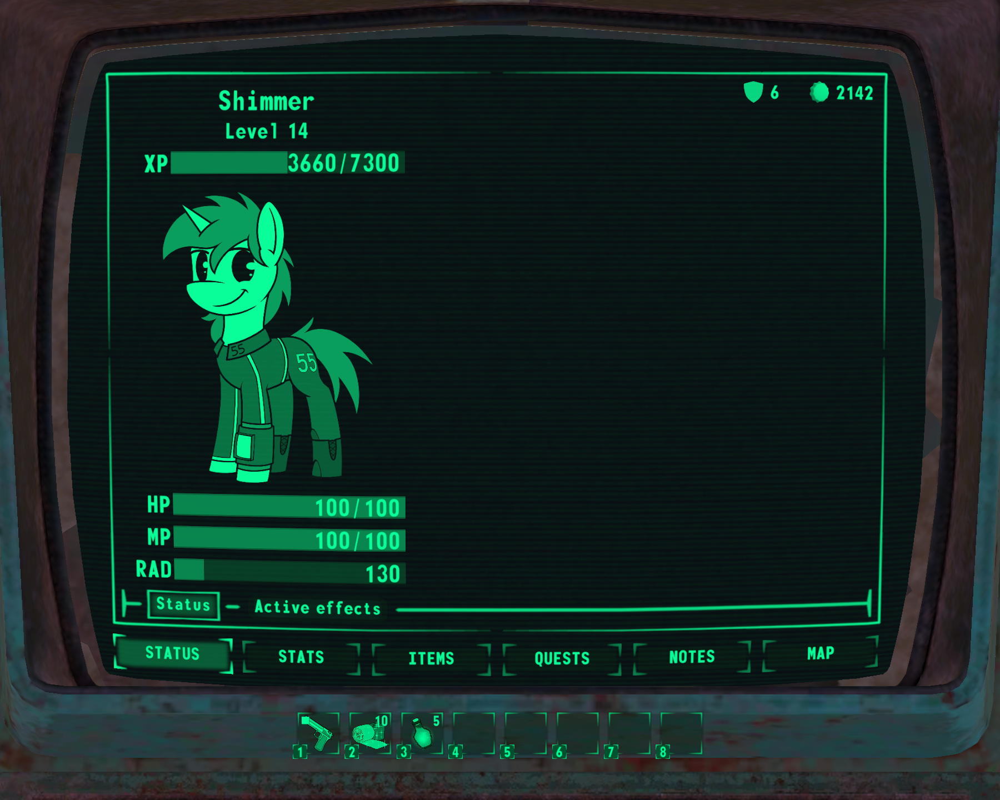
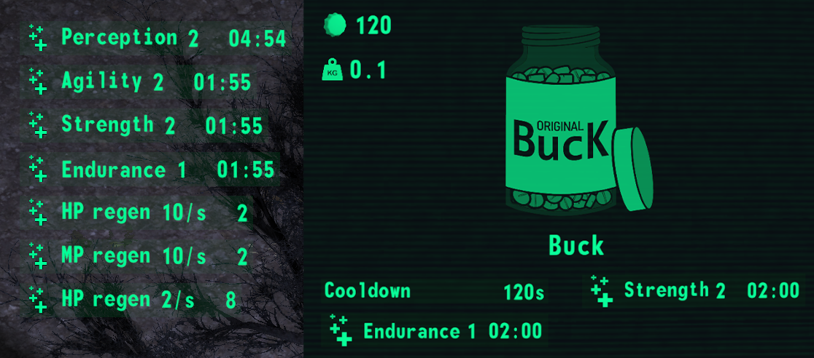
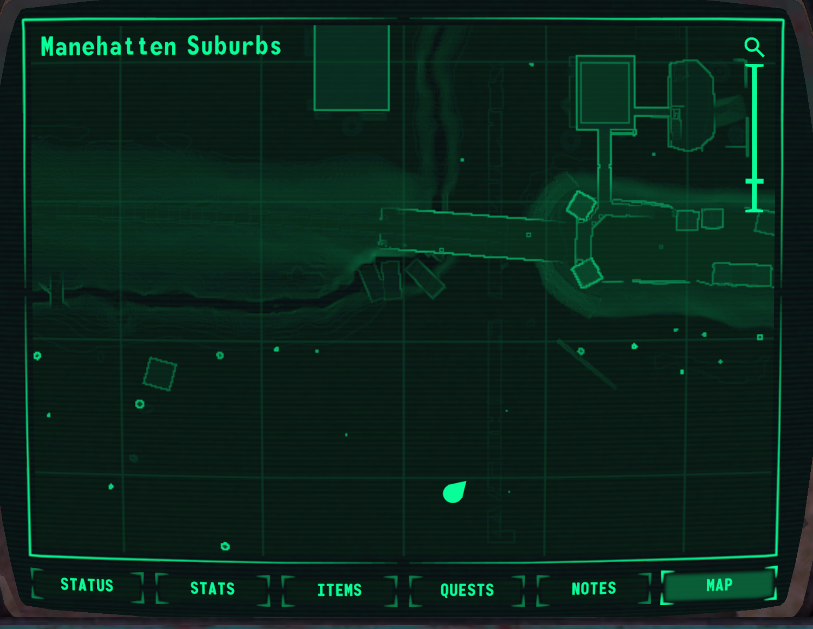

В этом посте вы узнаете что, как, что готово, что в разработке, что в планах.
Но сначала предлагаю посмотреть демонстрацию геймплея.

<iframe width="560" height="315" src="https://www.youtube.com/embed/DdaBoSXX5ck" title="YouTube video player" frameborder="0" allow="accelerometer; autoplay; clipboard-write; encrypted-media; gyroscope; picture-in-picture; web-share" allowfullscreen></iframe>

<!-- end -->

# Что это такое - Megaspell?

Megaspell проще всего описать так: это как если бы Alien Shooter был RPG про пони. Из Alien Shooter здесь расположение камеры, управление персонажем и стрельба. Из Fallout же пришли RPG элементы - SPECIAL, навыки, особенности. Сеттинг - мир постапокалиптической Эквестрии, а также поддерживается мультиплеер до 20 игроков.

Хотя первые тесты были в 2019, разработка началась только летом 2021, и вышла на темп только весной 2023 (т.е. примерно ⅔ было сделано за последние 6 месяцев). Изначальный план сделать 2D сайдсколлер по мотивам Remains сперва превратился в 2D изометрию, а затем уже в полноценное 3D с видом сверху.

Пока что команда состоит из двух человек: Shimmermare - организация и код, и dacaoo - арт. Мы осознаём, что у нас нет возможности захватить внимание игрока детализированными локациями или глубоким сюжетом, поэтому фокус - это геймплей, стиль и "ощущения" (feels). Ассеты на вторых ролях, и поэтому в качестве рига используется SFM, многие ассеты это доступные бесплатно либо купленные в сторе, а количество кастомных сведено к минимуму. Если игрок засчёт геймплея весело проводит время, он не заметит что у какого-нибудь пистолета хват не ртом а рукой.

Теперь, когда ядро игры готово, мы готовы к первому публичному релизу. До середины ноября мы выпустим демо с режимом Death Match. В состав этого демо будет входить:
- Геймплейное ядро с PvPvE боёвкой.
- Одна карта для DM.
- Публичные сервера.  

Мы ожидаем что это поможет протестировать игру на баги, подтвердить или опровергнуть наши предположения по механикам, а также привлечь заинтересованных в команду разработки.

После этого будут регулярные релизы для каждой новой фичи, мы не видим смысла накапливать изменения.

## Режимы игры

Решено сфокусироваться на 2 режимах:
- Death Match - рандомный спавн с выбранным набором экипировки, поиск предметов на карте, охота на других игроков. Режим был выбран т.к. позволяет проводить быстрое тестирование и его можно оставить работать 24/7 для тестов сетевой составляющей.
- История - основной режим, который требует не столько фич, сколько контента. Именно тут нам требуется помощь: со сценарием, с левел дизайном, с 3D артом.

Так же если будет интерес, то есть возможность создать РП режим игры, где будут доступны инструменты управления миром, можно кидать кубики и т.д.

# Реализованные фичи и механики

## Мультиплеер / COOP

Игра работает по модели встроенного сервера, т.е. даже при игре в одиночку создаётся локальный сервер. Это значит, что все игровые механики изначально поддерживают взаимодействие нескольких игроков.
В случае сюжетного режима, прогрессия других синхронизирована с хостом, и их профили хранятся именно у хоста. Вы могли видеть такую особенность в Borderlands.

Максимальное кол-во игроков ограничено только производительностью сервера и терпимостью к лагам, но на 20 игроках заметных лагов быть не должно.
На текущий момент для того чтобы сервер был виден во внешнем интернете нужно обладать белым IP.

## Редактор персонажа
Тут можно описывать каждый элемент по отдельности, но проще показать видео.
<iframe width="560" height="315" src="https://www.youtube.com/embed/PX85zPfOCAA?si=yfMMA2PP1M06WaXv" title="YouTube video player" frameborder="0" allow="accelerometer; autoplay; clipboard-write; encrypted-media; gyroscope; picture-in-picture; web-share" allowfullscreen></iframe>

Выбор разных типов грив/хвостов пока что небольшой, т.к. в планах есть переход на другую версию рига. И да, изменения облика отобразятся у других игроков мгновенно.

## ПипБак
Как и полагается FoE, пипбак тут играет центральную роль - в нём можно узнать текущий статус, статистику, управлять инвентарём, изучить карту.

### Статус
Текущее состоянием персонажа

#### Очки здоровья, маны, действия
ОЗ/ОМ/ОД пассивно регенерируют, скорость зависит от параметров персонажа. Мана используется для каста заклинаний, ОД - для спринга и для З.П.С.

#### Эффекты
Эффекты это модификаторы с определённой силой и временем действия, которые могут быть добавлены персонажу. Работают как в Minecraft - есть позитивные и негативные, эффекты одного типа сливаются. Расходники (еда, медицина) это основной их источник.

### Атрибуты, навыки, особенности

#### SPECIAL
Атрибуты перенесены без изменений - такой акроним слишком крутой, чтобы его ломать.

#### Навыки
Изменения относительно FNV - Энергооружие переименовано в Магическое оружие, навык Выживание заменен на Зельеварение, добавлен навык Телекинез.

#### Особенности
Нет каких-то отличий относительно FNV - особенности также могут иметь больше одного уровня и негативные эффекты.

<iframe width="560" height="315" src="https://www.youtube.com/embed/_c-IGB5ZFjU?si=4845OcXnlty4UC_5" title="YouTube video player" frameborder="0" allow="accelerometer; autoplay; clipboard-write; encrypted-media; gyroscope; picture-in-picture; web-share" allowfullscreen></iframe>

### Предметы и инвентарь
Для тех кто знаком с Minecraft, тут понятие предмета идентично - тип, свойства и количество формируют стак. Пример свойства - изношенность у оружия.
Инвентарь не имеет слотов и ограничен только переносимым весом, стаки у которых одинаковые тип и свойства объединяются в один.

### Экипировка
Есть 5 слотов экипировки: Голова, Глаза, Мордочка, Шея и Тело, и отдельно стоит слот рук/копыт. Одежда может использовать больше одного слота одновременно. Например, можно надеть шляпу, очки и респиратор одновременно, либо один закрытый шлем.
Присутствует 9 типов урона, и разная одежда может давать разную защиту от каждого из них.

### Карта уровня
Игровой мир состоит из отдельных локаций перемещение между которыми осуществляется на глобальной карте. Каждая такая локация может иметь несколько уровней.
Размер уровня ограничен 1024х1024 метрами. Одновременно может быть загружен только один уровень, для перехода на другой уровень все игроки должны подойти к переходу.

ПипБак имеет функцию автоматической карты уровня, на которой можно увидеть позицию игрока и точки интереса.

## Боевая система
Быстрый бой с необходимостью постоянно перемещаться. Можно ожидать сражений с 3-10 NPC одновременно.
<iframe width="560" height="315" src="https://www.youtube.com/embed/5nADJwlJ7GA?si=OXuCzEcieD79g8rI" title="YouTube video player" frameborder="0" allow="accelerometer; autoplay; clipboard-write; encrypted-media; gyroscope; picture-in-picture; web-share" allowfullscreen></iframe>

### Оружие
Огнестрельное и магическое оружие делится на мгновенное (пули, лучи) и физическое (ракеты, плазма). Есть разные типы патронов под разные ситуации.  
Копытопашный бой отсутствует в планах, но холодное оружие использовать так же весело.  
<iframe width="560" height="315" src="https://www.youtube.com/embed/PXQR6iA-m0k?si=aT85Fyz_XolBMlDe" title="YouTube video player" frameborder="0" allow="accelerometer; autoplay; clipboard-write; encrypted-media; gyroscope; picture-in-picture; web-share" allowfullscreen></iframe>

### Магия

#### Заклинания
Заклинания могут быть защитными и атакующими. Для каста необходим свиток (не тратится) и запас маны.
<iframe width="560" height="315" src="https://www.youtube.com/embed/k3ElhXqcrzQ?si=7XITHIPDx54AdPWr" title="YouTube video player" frameborder="0" allow="accelerometer; autoplay; clipboard-write; encrypted-media; gyroscope; picture-in-picture; web-share" allowfullscreen></iframe>

### Модель урона
Модель повреждений базируется на противостоянии двух значений: пробитии атакующего и защите атакуемого. На эти параметры влияет экипировка и её состояние, активные эффекты, перки, и другие модификаторы.

### ИИ
Для ИИ NPC используется планировщик GOAP, что в перспективе позволяет сделать ИИ произвольной сложности и хитрости, но пока что NPC в бою просто очень агрессивны. Забавный факт: GOAP использовался в такой игре как FEAR, и в системе A-Life из STALKER-а тоже он.

### Туман войны
Другие персонажи находящиеся вне прямой видимости игрока скрыты, а объекты затенены. Сила тени зависит от освещения на уровне, на поверхности днём это полутень, а ночью или под землёй это абсолютная темнота.
<iframe width="560" height="315" src="https://www.youtube.com/embed/Gj9s72h7T-I?si=8gly3mZbnqk38pqO" title="YouTube video player" frameborder="0" allow="accelerometer; autoplay; clipboard-write; encrypted-media; gyroscope; picture-in-picture; web-share" allowfullscreen></iframe>

### Репутация
В игре есть фракции и система репутации. Пока что она достаточно примитивная: убийства понижают репутацию, дружественные NPC приходят на помощь друг-другу.

# В разработке или в планах
На гитхабе под сотню тикетов, все перечислять тут просто не хватит места. Ниже выборка из интересных тикетов.

## З.П.С (S.A.T.S)
А точнее вторая его часть, потому что часть с подсветкой возможных действий уже реализована.
Было много обсуждений по конкретной реализации, мультиплеер добавляет свои ограничения. Один из вариантов это гарантированные криты во время действия З.П.С.

## ЛУМ (EFS)
Те самые зелёные и красные полоски становятся интересным вызовом для UI дизайнера из-за камеры с видом сверху.

## Прокачка уровня
Стандартная прокачка уровня для фола, но с изменением: очки для прокачки навыков или особенностей можно будет накапливать и применять в любой момент, а не мучить себя выбором на месте.

## Угрозы окружающей среды

### Магическая радиация
Тут всё стандартно, при нахождении в определённых зонах начинает тикать счётчик. Чем больше излучения накоплено, тем меньше макс ОЗ, и тем больше негативных эффектов.

### Порча / ЗВТ
С этим есть идея сделать скрытый счётчик, с ростом которого будут добавляться случайные мутации. Фокус на "случайные" - в том числе позитивных. По задумке, это будет работать как заточки в корейских MMO - с увеличением уровня заражения порчей будет уменьшаться шанс положительных и увеличиваться шанс отрицательных мутаций. Если повезёт, то можно набрать стрик из положительных мутаций. Излечиться частично нельзя, при излечении все мутации исчезнут. Это подтолкнёт игрока не рисковать, если у него хороший набор мутаций.

## Ремонт
Сейчас есть состояние предмета, но нет способа его починить. План - повторить систему ремонта подобное-подобным из фола.

## Новый риг для пони, расы, боевые сёдла
Сейчас в игре используется достаточно старая версия SFM рига, к тому же кастомизированная так что анимации с ней несовместимы. План - перейти на v6 риг, и добавить в игру все доступные модели тела/окраски/грив/хвостов/одежды/итд.
После этого появится возможность добавить другие расы пони и боевые сёдла.

## Сетевая игра через Steam
У большинства нет доступа к белым IP, поэтому добавление Steamworks очень важно. Это позволит хостить сервер без какой-либо подготовки, ну и другие фичи стима типа подключения через список друзей тоже пригодятся.
**ВАЖНО: это не значит что игра выйдет в Steam! Valve разрешают использовать Steamworks без отдельной игры в их магазине.**

## Зельеварение
Зельеварение играет роль журналов из FNV - временные бафы к параметрам персонажа. Сам процесс создания зелий ещё не проработан, но это точно будет мини-игра, а не список рецептов с кнопкой. Необходимость общей системы крафта пока под вопросом.

## Взлом замков
Хотелось бы придумать более интересную мини-игру чем всем надоевший взлом родом из F3.

## Терминалы
Стандартные для фола терминалы. За исключением, разве что, мини-игры по взлому, которую хочется сделать повеселее.

## Квестовая и диалоговая системы
Необходимы для сюжетного режима. От систем требуется работать в коопе и кастомизируемость для того чтобы сценарист мог воплотить свои идеи не написав ни единой строчки кода.

## Перемещение по глобальной карте и случайные встречи
Прямо как в Fallout 1/2. Глобальная карта поделена на зоны со своими собственными случайными встречами и уровнями. Когда игроки попадают на случайную встречу, выбирается случайный уровень из доступных и на нём спавнятся все участники встречи.

# Клич помощи
Нам очень нужна помощь с дизайном уровней, нарративом, 3D артом. Но и от любой другой помощи мы не откажемся.
Если вы готовы помочь безвозмездно - это замечательно, но мы понимаем что это часто невозможно, поэтому не против делать коммишены на сложный контент.

## Дизайн уровней
В данный момент самая большая проблема, т.к. требует много времени и фантазии, чего у нас нет. Для того чтобы создать уровень нужно нарисовать террейн, разместить подходящие префабы, а если подходящих префабов нет - заменить их временными фигурами и создать тикет на добавление моделей. Все это делается внутри движка и не требует технических знаний.

## Нарратив и текста
Сюжет, описания предметов/особенностей, записки, диалоги. Казалось бы, со стороны выглядит просто, но у нас выходит какое-то васянство. Формально всё это можно делать в текстовом файле, но если освоить движок то можно сразу увидеть результат.

## 3D арт
Большую часть моделей можно найти бесплатно или за небольшую цену, но иногда нужно что-то пони-специфическое, и тут других вариантов кроме как делать свои нет. Благодаря удаленности камеры модели могут быть грубые и всё равно выглядеть хорошо, так что самое то для новичков.

## Звук
Сейчас работа со звуком представляет собой "двигать полоски пока не зазвучит". Хотелось бы иметь человека, который хотя бы может подсказать что не так или как достичь определённых эффектов.

## 2D арт
Сейчас в этом нет острой необходимости, но вы можете помочь dacaoo с иконками предметов и другими иллюстрациями.

## Локализация
Мы по умолчанию предоставляем английский и русский. Если кто-то желает добавить новую локализацию, то это достаточно просто и делается не выходя за пределы Google Sheets.

## Код
В Unity используется имплементация C# примерно эквивалентная C# 9 / .NET Standard 2.1. Так же есть бэкэнд на Java+Spring, и в будущем будет фронт. Если что-то из этого вас интересует - welcome, но сразу предупрежу чтобы не было непоняток, коммишенов на код не будет.

# Техническая информация
Игра написана на движке Unity 2023 с использованием URP.

## Минимальные технические требования
Для стабильных 30 FPS и средних 50 FPS хватает PC из 2011 года:  
CPU Intel i7-2600, GPU GTX550 1Gb, 8 GB RAM

# Пара слов о монетизации и лицензировании
**Игра полностью бесплатная, никакой монетизации в планах нет.**  
Единственный допустимый для нас вариант это сборы на конкретные заказы конкретной работы или ассетов.

## Лицензирование проекта
Собственный код игры, т.е. всё что мы написали сами, будет доступно всем под открытой лицензией GNU GPL3
Собственные ассеты, по мере возможности, будут доступны под CC-BY-SA 4.0

К сожалению опубликовать файлы проекта целиком мы не можем, т.к. во-первых активно используются лицензированные плагины, а во вторых покупка ассетов чаще всего не даёт права на их распространение.

## Использование чужих IP
Мы полностью избегаем включения ассетов на которые у нас нет прав в проект. Да, было бы значительно проще заполнять уровни просто вытащив модели из игр Bethesda, да и скорее всего им было бы всё равно, но мы с этим связываться не хотим. Сейчас используются несколько моделей которые хоть и не из Fallout, но очень подробно копируют оттуда дизайн. Например, текущий ПипБак. Планируется заменить все такие модели собственными версиями.

Концепты и идеи, например SPECIAL, мы решили использовать без изменений т.к. шансы что с этим будут какие-то проблемы ничтожно мал.

## Моды
Архитектура игры строится таким образом чтобы не препятствовать модификации стандартным способом для игр на Unity (минимум хардкода, максимум пропертей), но прямой поддержки модов на данный момент не планируется. Разработчикам модов предлагается запросить доступ и форкнуть игру, под условием что лицензированные 3rd party ресурсы не будут распространятся с нарушением лицензий. А ещё лучше - влиться в команду и добавить свои идеи в основную версию :)

Отдельно про локализацию: файлы локализации будут доступны на Google Sheets, и если кто-то хочет добавить новую локализацию / быть переводчиком существующей - просто напишите нам.

# Прогнозы на будущее

## Сценарий позитивный
Нам удалось получить помощь с левел дизайном, нарративом и 3D артом. После релиза DM мы смещаем фокус на поддержку разработки сторимода, для того чтобы не блокировать команду.
В этом случае в ближайшие 6 месяцев можно будет поиграть в начало сюжетного режима.

## Сценарий нейтральный
Нам удалось получить какую-то помощь, но этого недостаточно чтобы наполнить мир контентом для сюжетного режима. В таком случае мы можем сфокусироваться на процедурном контенте, и выпустить режим фриплея где можно выполнять автоматические квесты на сгенерированных локациях. Это тоже займёт 6+ месяцев.

## Сценарий негативный
Никакой помощи получить не удалось, поэтому фокус на то что мы можем сделать - геймплейные механики, UI, процедурный контент. Через год или два у нас на руках будет фриплей с процедурным контентом, и может уже тогда получится найти команду.

**Во всех вариантах развития событий не меняется тот факт что я, Shimmermare, не брошу разработку в обозримом будущем.** Чтобы был понятен уровень моей вовлеченности в этот проект, я ушёл из Яндекса чтобы работать над Megaspell фуллтайм.

# Спасибо за внимание
Следите за прогрессом в Discord: https://discord.gg/XfXPfz75Rv
