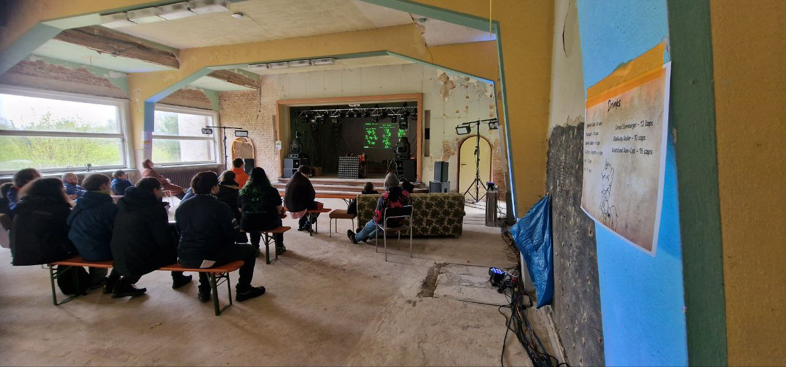

Update is available in launcher ([**Windows**](https://github.com/Megaspell/MegaspellLauncher/releases/latest/download/Megaspell-Launcher-Installer.exe), [**Linux**](https://github.com/Megaspell/MegaspellLauncher/releases/latest/download/Megaspell-Launcher.AppImage)) or by [direct link](https://github.com/Megaspell/Megaspell-Releases).

# News 

## Our first public presentation

We just did our first ever public live presentation at Littlepip's Little Party, and you know what? Turns out that making good presentations is harder than making games.

Although a little short, for the first time it wasn't so bad.

**A video version of the presentation will be uploaded to YouTube in the coming weeks.**

Photos from presentation
  

Prizes for FoE quiz made by Themisto based on [art by dacaoo](https://derpibooru.org/images/3224291)

### Presentation on YouTube

# April Update

Video with updated gameplay and visuals
<iframe width="560" height="315" src="https://www.youtube.com/embed/89dt9vrR2G8" title="YouTube video player" frameborder="0" allow="accelerometer; autoplay; clipboard-write; encrypted-media; gyroscope; picture-in-picture; web-share" allowfullscreen></iframe>

## New visual style

We changed our impression of wasteland. Previously, we imagined it to be an arid place, devoid of any flora, 
with only occasional green oasis here and there. But that doesn't make any sense when sky is covered by clouds 24/7, does it?

That's why now wasteland is more green, and some places even swampy.

(P.S. We know that grass looks bad, we will change it later.)

## Terminal

Added terminals! They come in 2 varieties: tabletop, and wall-mounted.
<iframe width="560" height="315" src="https://www.youtube.com/embed/UsoS2QcPD3k" title="YouTube video player" frameborder="0" allow="accelerometer; autoplay; clipboard-write; encrypted-media; gyroscope; picture-in-picture; web-share" allowfullscreen></iframe>

## Day-night cycle

Added day-night cycle, with 1 in-game day = 1 real hour (subject to change).

<iframe width="560" height="315" src="https://www.youtube.com/embed/Fc8oQMbWPqA" title="YouTube video player" frameborder="0" allow="accelerometer; autoplay; clipboard-write; encrypted-media; gyroscope; picture-in-picture; web-share" allowfullscreen></iframe>

## New pony rigs

We finally moved from customized rig based on old SFM ponies to standard ReVAmped (V6) ponies.

As you can see, V6 is way more detailed. But not only that, now you finally can play as a stallion!
And, suddenly, as a batpony. Or, at least, as a unicorn with batpony ears.

Along with that a new customization options was added - you now can customize character height.

Beside visual changes, this unlocked the ability to add new animations and use compatible armor models. 

**Ponies can wear clothes, finally!**

Thanks to people who made V6 possible:
[AeridicCore](https://twitter.com/aeridiccore),
[BeardedDoomGuy](https://twitter.com/beardeddoomguy),
[DonglySFM](https://twitter.com/DonglySFM),
[ImAFutureGuitarHero](https://www.deviantart.com/imafutureguitarhero),
[Jacob_LHh3](https://twitter.com/jacob_lhh3),
[Raymond](https://twitter.com/r2d2aRtU),
Silkworm,
[Sprocket](https://twitter.com/roombaoverlord),
[ThanosSlim](https://twitter.com/carrotgoldmlp)

# Full changelog 

## Fixes
- Fix top down camera not adjusting for character height.
- Fixed material mismatch for most objects (e.g. metal looking things are now actually metal with appropriate sounds and particles).
- Fixed an error when trying to drag amount selector dialogue.
- Unable to re-enter the game after exiting to main menu.
- Fixed nametag scaling and position when in freecam.
- Fix annoying warning about override for missing binding on each game start (now will be shown once).
- Now it's not possible to clip or shoot through the disappearing roofs and walls.
- Desert Griffon no reload animation.
- Game version check when joining a server was not working.
- Client can connect to wrong server if previous connection attempt to a different server was cancelled.

## UI
- Added quick looting of item containers.
- Added terminals! They come in 2 varieties and you can found some at new checkpoint building on Manehatten Suburbs.
- World text such as interaction tips now doesn't move with cursor and instead locked to object position. This makes it way more readable.
- Optimized world text so there is no longer performance impact when a lot of damage indicators displayed at once.
- Loadout item order on respawn screen is now consistent with how it looks ingame.
- Now HUD visibility transition (e.g. on PipBuck toggle) is smooth.
- Now HUD can be disabled by pressing F1.
- Added visual and sound cue when trying to use item that can't be used (e.g. on cooldown, wrong context).

## Graphics
- Changed the general theme: no more arid wasteland, now game is aiming for much more wet environment.
- Added day-night cycle - currently 1 game day is 1 real hour - this can be changed later.
- Now camera has perspective - previously we had troubles with depth perception, but now it feels way better.
- Pony rig and models changed to ReVAmped (V6) - now ponies look much better.
- Slightly improved focused objects outline visuals.
- Ponies are now blinking.
- Pony ears now have jiggle physics.
- Add item models for Healing Potion, CatEye, Rad-Safe.
- Added model for stable suit.
- Now PipBuck is visible on character model.
- Changed anti-aliasing from FXAA to SMAA.

## Character creator
- Now you finally can select stallion in character creator.
- Added batpony character variant to character creator.
- Now character creator can be opened only ingame.
- Added height sliders to character creator Height doesn't affect hitboxes.
- Now "no talent mark" is selectable option.
- Changed preview to show mane/tail physics.

## Gameplay
- Added Telekinetic throw spell: throw the levitated object with great velocity in aim direction.
- Now all doors on level are interactable and can be opened/closed.

## Controls
- Removed camera modes other than Follow cursor.
- Now focus on object is kept as long as it is levitated.

## Levels
- General terrain and outline for *REDACTED* level.
- Updated Manehatten Suburbs - added checkpoint, diner, changed roads, finally replaced placeholder fountain with a proper model, and other changes.
- Added sample poster to checkpoint building that can be used to check out close up view system.

## Sounds
- Added ambient wind sound.

## Other
- Now talent marks are loaded from datapacks.
- Added command to kill your character - `suicide`
- Added check for game files integrity and a warning if something is wrong.