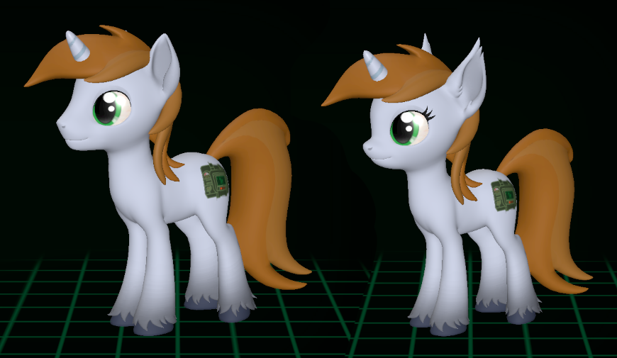

Обновление уже доступно для загрузки в лаунчере ([**Windows**](https://github.com/Megaspell/MegaspellLauncher/releases/latest/download/Megaspell-Launcher-Installer.exe), [**Linux**](https://github.com/Megaspell/MegaspellLauncher/releases/latest/download/Megaspell-Launcher.AppImage)) или [напрямую](https://github.com/Megaspell/Megaspell-Releases).

# Новости

## Наша первая публичная презентация

Мы только что провели нашу первую публичную презентацию на конвенте Littlepip's Little Party, и знаете что?
Оказывается, создание хороших презентаций сложнее, чем создание игр.

Хотя она была немного короткой, для первого раза вышло неплохо.

**Видео-версия презентации будет загружена на YouTube в ближайшие недели.**

Фото из зала
  

Призы для квиза по FoE сделанные Themisto на основе [арта от dacaoo](https://derpibooru.org/images/3224291)

# Апрельское обновление

Демонстрация обновлённого геймплея и графики
<iframe width="560" height="315" src="https://www.youtube.com/embed/89dt9vrR2G8" title="YouTube video player" frameborder="0" allow="accelerometer; autoplay; clipboard-write; encrypted-media; gyroscope; picture-in-picture; web-share" allowfullscreen></iframe>

## Новый визуальный стиль

Мы изменили свое представление о пустоши. Раньше мы представляли её как сухое место, лишенное растительности, 
где только изредка встречаются зеленые оазисы. 
Но это не имеет никакого смысла, если небо вечно закрыто облаками, так ведь?

Поэтому теперь пустошь стала более зеленой, а в некоторых местах даже болотистой.

(P.S. Мы знаем, что трава выглядит плохо, это будет исправлено.)

## Терминалы

Добавлены терминалы в двух вариантах: настольный, и настенный.
<iframe width="560" height="315" src="https://www.youtube.com/embed/UsoS2QcPD3k" title="YouTube video player" frameborder="0" allow="accelerometer; autoplay; clipboard-write; encrypted-media; gyroscope; picture-in-picture; web-share" allowfullscreen></iframe>

## Цикл смены дня и ночи

Добавлена смена дня и ночи. Один игровой день равен одному реальному часу (ещё может поменяться).

<iframe width="560" height="315" src="https://www.youtube.com/embed/Fc8oQMbWPqA" title="YouTube video player" frameborder="0" allow="accelerometer; autoplay; clipboard-write; encrypted-media; gyroscope; picture-in-picture; web-share" allowfullscreen></iframe>

## Новые пони риги

Мы наконец-то перешли с кастомного рига, основанного на старых SFM поняшках, на стандартный риг ReVAmped (V6).

Как видите, у V6 гораздо больше деталей. И не только это, ведь теперь наконец-то можно играть за жеребца!
...И за мышепони. Или, по крайней мере, за единорога с ушами мышепони.

Вместе с этим была добавлена возможность настраивать высоту персонажа в разумных пределах.

Кроме визуальных изменений, новый риг разблокировал нам возможность добавлять новые анимации, а так же использовать совместимые модели одежды и брони.

**Пони наконец-то могут носить одежду, ура!**

Спасибо людям работавшим над проектом ReVAmped:
[AeridicCore](https://twitter.com/aeridiccore),
[BeardedDoomGuy](https://twitter.com/beardeddoomguy),
[DonglySFM](https://twitter.com/DonglySFM),
[ImAFutureGuitarHero](https://www.deviantart.com/imafutureguitarhero),
[Jacob_LHh3](https://twitter.com/jacob_lhh3),
[Raymond](https://twitter.com/r2d2aRtU),
Silkworm,
[Sprocket](https://twitter.com/roombaoverlord),
[ThanosSlim](https://twitter.com/carrotgoldmlp)

# Полный список изменений

## Исправления
- Исправлена проблема с камерой, которая не учитывала относительную высоту персонажа.
- Исправлено несоответствие физических материалов для большинства объектов (например, металлические вещи теперь действительно металлические с соответствующими звуками и частицами).
- Исправлена ошибка при попытке перетащить диалоговое окно выбора количества предметов.
- Невозможность вернуться в игру после выхода в главное меню.
- Исправлено масштабирование и позиция полосок имени и хп в режиме свободной камеры.
- Устранено раздражающее предупреждение об отсутствующем бинде при каждом запуске игры (теперь будет показано один раз).
- Теперь невозможно пройти  или стрелять сквозь скрываемые крыши и стены.
- Исправлена анимация перезарядки для пустынного грифона.
- Проверка версии игры при подключении к серверу не работала.
- Клиент может подключиться к неправильному серверу, если предыдущая попытка подключения к другому серверу была отменена.

## Интерфейс
- Добавлена быстрый лутинг инвентарей.
- Добавлены терминалы! Они бывают в двух вариантах, и вы можете найти их в новом здании КПП на Окраинах Мейнхеттена.
- Текст в мире, такой как подсказки взаимодействия, теперь не двигается вместе с курсором. Это делает его гораздо более читаемым.
- Оптимизирован текст в мире, так что теперь нет просадок FPS, когда одновременно отображается очень много индикаторов урона.
- Порядок предметов в наборе на экране возрождения теперь соответствует ему же в игре.
- Теперь переход видимости интерфейса (например, при переключении ПипБака) плавный.
- Теперь интерфейс можно отключить, нажав на F1.
- Добавлен визуальный и звуковой сигнал при попытке использовать предмет, который нельзя использовать (например, на перезарядке, или неправильный контекст).

## Графика
- Изменена общая тема: больше нет сухой пустоши, теперь игра нацелена на гораздо более влажную среду.
- Добавлен цикл день-ночь - в настоящее время 1 игровой день равен 1 часу в реальном времени - это может измениться позже.
- Теперь у камеры есть перспектива - раньше у нас были проблемы с восприятием глубины, но теперь это чувствуется намного лучше.
- Риги и модели пони изменены на ReVAmped (V6) - теперь пони выглядят намного лучше.
- Немного улучшен вид обводки объектов в фокусе.
- Пони теперь моргают.
- У пони теперь есть физика ушей.
- Добавлены модели предметов для Лечебного зелья, Кошачего Глаза, Рад-Защиты.
- Добавлена модель костюма стойла.
- Теперь ПипБак виден на модели персонажа.
- Алгоритм сглаживания изменён с FXAA на SMAA.

## Редактор персонажа
- Теперь можно выбрать жеребца в редакторе персонажей.
- Добавлены мышепони.
- Теперь редактор персонажей может быть открыт только после подключения к серверу.
- Добавлен ползунок высоты персонажа. Высота не влияет на хитбоксы.
- Теперь можно выбрать "нет метки" при выборе метки таланта.
- Теперь в превью работает физика волос, а так же можно выбрать анимацию.

## Геймплей
- Добавлено заклинание «Телекинетический бросок»: бросает леветируемый объект с большой скоростью в направлении прицела.
- Теперь все двери на уровне интерактивны и могут быть открыты/закрыты.

## Управление
- Удалены режимы камеры, кроме «Следовать за курсором».
- Теперь фокус на леветируемом объекте сохраняется пока он не отпущен.

## Уровни
- Базовый контур для *УДАЛЕНО* уровня.
- Обновлены Окраины Мейнхэттена - добавлен КПП, закусочная, изменены дороги, и наконец-то заменен временный фонтан на нормальную модель.
- Добавлен пример плаката в здание КПП, который можно использовать для теста системы осмотра.

## Звуки
- Добавлен звук ветра.

## Другое
- Теперь знаки талантов загружаются из датапаков.
- Добавлена команда для убийства своего персонажа - `suicide`
- Добавлена проверка целостности файлов игры и предупреждение, если что-то не так.