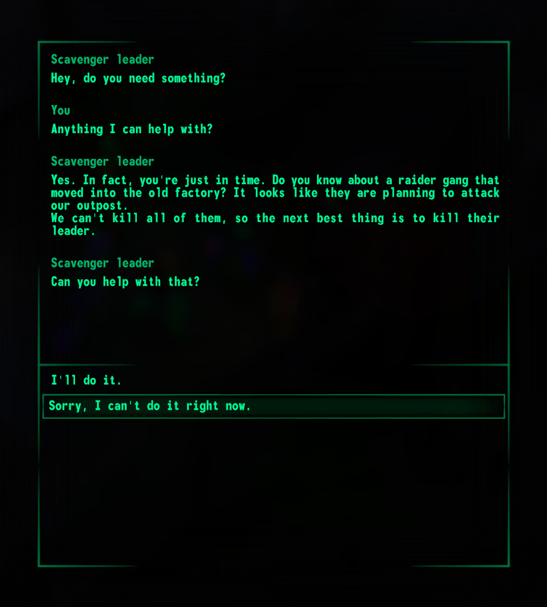
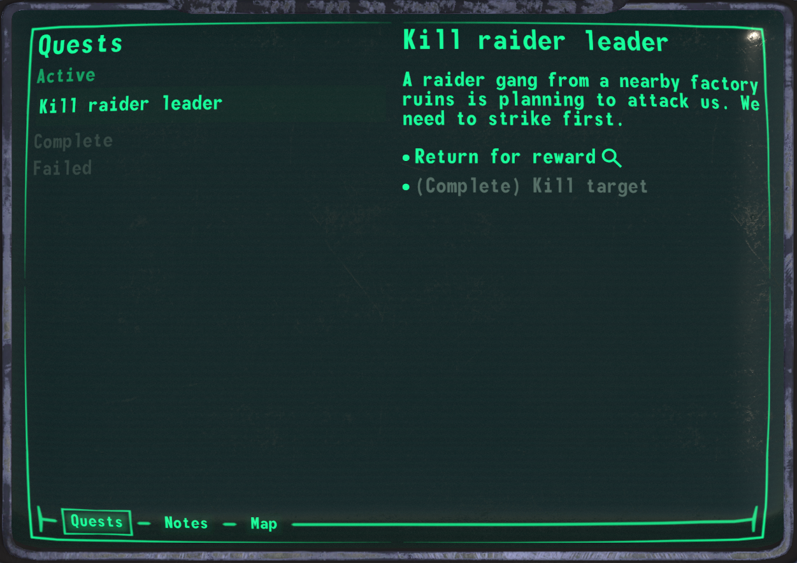

In december we mostly focused on adding dialogue and questing systems.  

Update is available in launcher ([**Windows**](https://github.com/Megaspell/MegaspellLauncher/releases/latest/download/Megaspell-Launcher-Installer.exe), [**Linux**](https://github.com/Megaspell/MegaspellLauncher/releases/latest/download/Megaspell-Launcher.AppImage)) or by [direct link](https://github.com/Megaspell/Megaspell-Releases).

# Month's progress

## Dialogue system
Dialogues are powered by [Yarn Spinner](https://yarnspinner.dev/), which is a node-based dialogue system used by games such as Night in the Woods.
Yarn required a few modifications to work in our multiplayer scenario, but in general it works for non-linear dialogues with various speech/skill/attribute/other checks - something that we want to do.

Dialogues work differently depending on game mode: in Death Match, everyone has their own story progression. In story mode, all players share the story and can all take part in dialogue **at the same time**.
For multiple participants stat checks use the best available value. For example, [Repair 50] check can be passed if only one of the players has 50 repair level.

Currently, there are 2 available characters with dialogue: scavenger and raider leaders.

(*Note: this dialogue was written by a programmer, not a writer.)

## Quests
For quest system we did go custom, because existing available solutions for some reason make it very hard to do complex quests. 
Some things we wanted from quest system:
- Multi-path - ability to solve a quest using different paths.
- Multi-entry - when depending on how you started the quest you receive different perspective. For example, taking the same quest from either side.
- Optional goals
- Reusable
- Support for procedural quests

To test the system, we added two simple quests you can get from faction leaders. Please try completing them to help us test the system.

## Datapacks
To support modding and to make things easier for us we're adding datapack system. It's directly inspired by Minecraft's resourcepacks/datapacks.
Here's how it works:
- When starting a game, you are able to select one or more datapacks with content.
- On datapack load order depends what content is actually used, since datapack overrides content of previously loaded datapacks.
- Datapack contains content such as: localized text, items, effects, perks, sandboxed JS scripts, cutiemarks, quests, dialogues, loot tables, spawn configs and possibly more.
- Datapacks WON'T have: 3D assets, scenes, levels, non-sandboxed code.
- There's possibility that other content type will be added later.

Right now datapacks are used only for internal stuff and can't be tinkered with, but we'll release detailed guide how to mod the game using datapacks later.

# Full changelog 
Other changes except dialogues, quests, datapacks include bugfixes and accessibility and UI improvements. Read full list below.

## Fixed bugs
- Weapon reloading is now propertly affected by timescale (e.g. SATS speedup).
- Multiple weapons now can't be reloaded at the same time.
- Fixed weapon juggling - now between-shot delay is not reset on weapon change.
- Story mode player character can't spawn due to bug in level loading.
- Fix item container UI missing background shadow.
- Dragged items were not dropped when exiting PipBuck.
- Object icons incorrectly scaled on unevenly scaled objects.
- Fix server announcement keepalive sometimes failing. This caused servers to disappear from server browser even though server is OK.

## Changes
- Added dialogue system with integrated Yarn Spinner and implemented dialogue UI.
- Added 2 quests to DM: simple kill quest for faction leaders. Reward is 2 sets of best gear.
- Added Minecraft-like datapack support (for now only scripts are loaded).
- Local Map UI is overhauled and now has better controls and visuals.
- Now teammates are visible on local map.
- Used ammo type now can be changed in PipBuck.
- Ammo types suitable for equipped weapon are now highlighted in inventory, with distinct highlight for current ammo type.
- Input modals (e.g. password input, amount input) now can be submitted by pressing Enter.
- Added Scroll sensitivity to control options.
- Values in slider inputs now can be entered by typing.
- Disable take all input in item container UI when amount selection is shown.
- Added "show hotbar" button to PipBuck items tab.
- Important characters now have distinct nametag marker.
- Removed resolution option (engine handles it better).
- Added FPS limit option (active only when vsync is off).
- Added render scale option.
- NPCs don't use weapon durability anymore.
- Allow to override story mode starting level with `--level` startup option.
- Added runtime scripting support (JavaScript ES6) with basic API.

# Plans for next month

## Finish UI for quests and dialogues
Things that are in development:
- Display quest status updates on HUD with sound indication.
- While in dialogue, actions such as receiving reward or accepting quests will be displayed in log.
- Dialogue logs will be available in PipBuck.
- For story mode, players will see what option other players are highlighting.
- For story mode, players that are not participating in dialogue will see dialogue log in chat.

## Leveling
Implement levels, earning XP, getting perk/skill allocation points for new level, and unlocking perks / leveling up skills.

## Implement EFS
Depending on perception level show nearby NPCs/players on the edge of the screen.

## Keep working on story mode