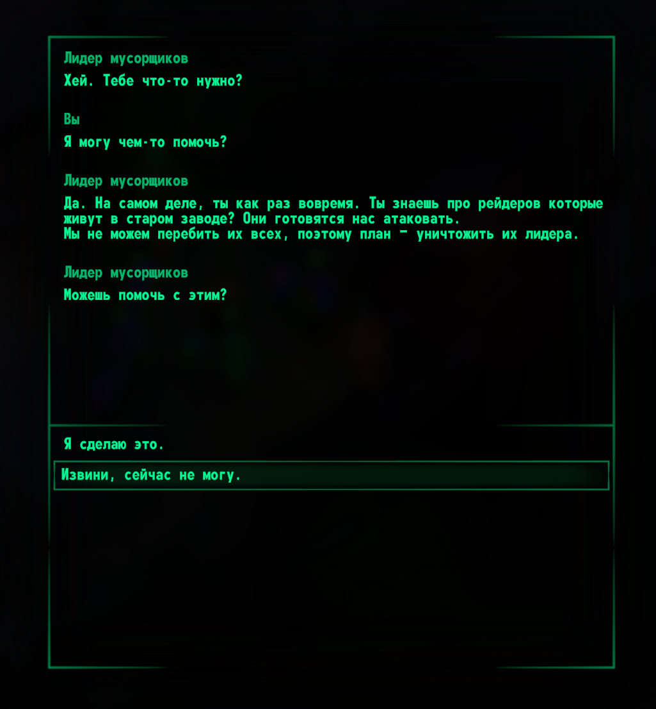
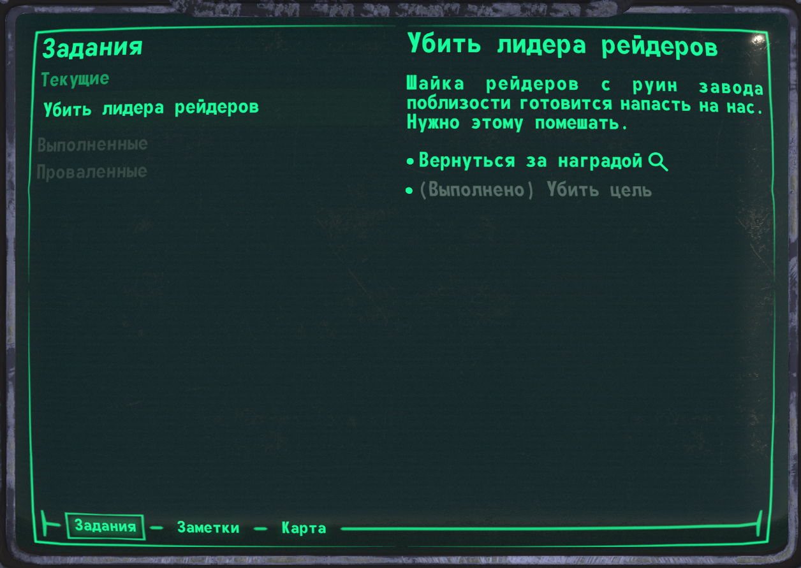

В декабре фокус разработки был в основном на системах диалогов и квестов. Этот блог должен был выйти в начале месяца, но новый год внёс свои коррективы.  

Обновление уже доступно для загрузки в лаунчере ([**Windows**](https://github.com/Megaspell/MegaspellLauncher/releases/latest/download/Megaspell-Launcher-Installer.exe), [**Linux**](https://github.com/Megaspell/MegaspellLauncher/releases/latest/download/Megaspell-Launcher.AppImage)) или [напрямую](https://github.com/Megaspell/Megaspell-Releases).

# Прогресс за месяц

## Система диалогов
Диалоги работают благодаря [Yarn Spinner](https://yarnspinner.dev/) - это нодовая система, её используют игры такие как Night in the Woods.
Потребовалось несколько модификаций в Yarn чтобы он заработал в нашем случае (мультиплеер), но в общем он работает и подходит для нелинейных диалогов с проверками навыков/перков/аттрибутов/итд - это как раз то что мы планируем.

Диалоги работают по-разному в DM и в сюжетке. В DM - каждый игрок имеет отдельную историю. В сюжетном режиме все игроки делят одну прогрессию истории - и могут участвовать в диалоге **одновременно**.
В случае если в диалоге больше одного игрока, значения для проверок берутся по формату "лучшее из доступного". Например, проверка [Ремонт 50] может быть пройдено если у любого из игроков есть 50 навыка ремонта.

В данный момент в DM доступно 2 персонажа с диалогами - это лидеры мусорщиков и рейдеров.

(*Заметка: этот диалог был написан программистом, а не писателем.)

## Квесты
С квестами мы пошли по другому пути и сделали собственную систему, потому что существующие доступные решения по затрудняют создание сложных квестов.
Что мы хотели от системы квестов:
- Поддержку нескольких способов выполнения.
- Контекст взятие квеста - когда в зависимости от того, как вы начали задание, вы получаете разную перспективу.
- Необязательные цели
- Повторяемые квесты
- Процедурные задания

Чтобы протестировать систему, мы добавили два простых задания, которые вы можете получить от лидеров фракций. Пожалуйста, попробуйте выполнить их, чтобы помочь нам протестировать систему.

## Датапаки
Чтобы поддержать моддинг и упростить разработка, мы добавляем систему датапаков. Она напрямую вдохновлена ресурспаками / датапаками из Minecraft.
Вот как это работает:
- При запуске игры вы можете выбрать один или несколько датапаков.
- От порядка загрузки датапака зависит, какой контент используется: датапак перезаписывает файлы содержащиеся в ранее загруженных датапаках.
- Из датапаков грузятся: локализованный текст, предметы, эффекты, перки, JS-скрипты (в сэндбоксе), кьютимарки, квесты, диалоги, таблицы лута, конфигурации спавна, и тд.
- В датапаках НЕ будет: 3D-ассетов, сцен, уровней, кода вне сэндбоксе.

Сейчас датапаки используются только для внутренних штук и помоддить не получится, но мы выпустим подробный гайд как делать моды с помощью датапаков позже.

# Полный список изменений 
Кроме диалогов/квестов/датапаков, были исправления, и улучшения доступности и UI. Полный список ниже.

## Исправления
- Перезарядка теперь правильно учитывает ускорение/замедление персонажа (например от З.П.С. или зелий).
- Теперь нельзя перезаряжать несколько стволов одновременно.
- Пофикшено жонглирование оружием - теперь задержка между выстрелами остаётся при переключении оружия.
- Персонаж в сюжетном режиме не спавнился из-за бага в загрузке уровня.
- Исправлено отсутствие тени в окне инвентаря.
- Перетаскиваемые предметы не сбрасываются при выходе из PipBuck.
- Значки интерактивных объектов неправильно масштабировались на объектах с неравномерным масштабом.
- Исправлен сбой в работе объявления сервера. Это приводило к исчезновению серверов из браузера, даже если сервер в порядке.

## Изменения
- Добавлена диалоговая система на основе Yarn Spinner и реализован пользовательский интерфейс диалога.
- Добавлены 2 задания в DM: простое задание на убийство для лидеров фракций. Награда - 2 комплекта лучшего снаряжения.
- Добавлена поддержка датапаках по образу Minecraft (пока загружаются только скрипты).
- UI карты уровня переработан и теперь имеет улучшенные элементы управления и визуал.
- Теперь позиции игроков команды видно на карте.
- Тип используемых боеприпасов теперь можно изменить в ПипБаке.
- Типы боеприпасов, подходящие для текущего оружия, теперь выделяются в инвентаре. Активный тип выделен отдельно.
- Элементы ввода (например, ввод пароля, ввод количества) теперь можно вводить нажатием Enter.
- Добавлена чувствительность прокрутки в настройки управления.
- Значения ползунков теперь можно вводить напрямую текстом.
- Добавлена кнопка "показать быстрый доступ" на вкладке инвентаре в ПипБаке.
- Важные персонажи теперь отмечены звёздочкой.
- Удалена опция разрешения (движок справляется с этим лучше).
- Добавлена опция ограничения FPS (активна только при выключенной vsync).
- Добавлена опция масштабирования рендера.
- NPC больше не используют прочность оружия.
- Теперь можно переопределить стартовый уровень для сюжетного режима с помощью `--level`.
- Добавлена поддержка загружаемых скриптов (JavaScript ES6) с базовым API.

# Планы на следующий месяц

## Закончить UI для квестов и диалогов
Находится в разработке:
- Отображать обновления статуса квеста на HUD со звуковой индикацией.
- Во время диалога такие действия, как получение награды или принятие квестов, будут отображаться в журнале.
- Логи диалогов будут доступны в ПипБаке.
- В сюжетном режиме игроки увидят, какую опцию выделяют другие игроки.
- В сюжетном режиме игроки, которые не участвуют в диалоге, увидят реплики из диалога в чате.
- 
## Прокачка
Уровни, получение опыта, очки распределения перков / навыков, разблокировка перков и прокачка навыков.

## ЛУМ
В зависимости от уровня восприятия отображение NPC и игроков поблизости по краям экрана.

## Продолжение работы над сюжетным режимом