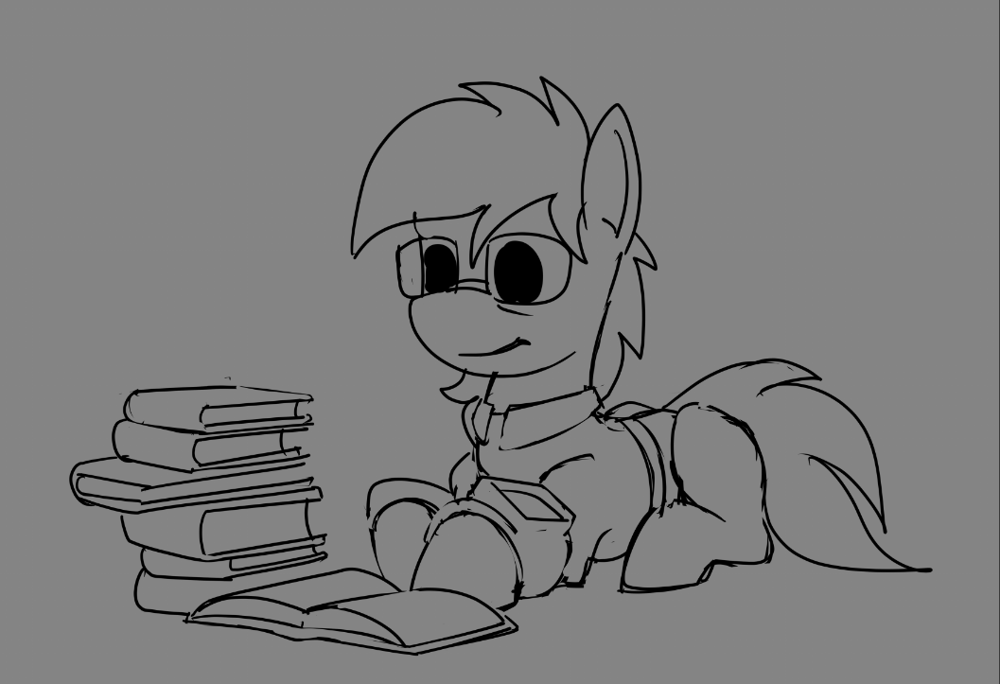

# News

## We're giving our first ever public talk!
Let's start with exiting news: we're giving a talk on April 20 at [Littlepip's Little Party](https://lplp.pony.style/)!  
We will talk about current progress, history of the project, the future including the Stable 55 story demo, and some fun stories from development.  
You'll be able to see the talk online (hopefully) live, or on our youtube later.

## Update schedule
Prior to this moment we tried to maintain once a month update schedule. But the cruel truth is we just don't have resources to produce meaningful amount of changes in just one month.
Because of this, most of you just don't download new versions to check them out, and that's understandable - there's simply not enough new and exiting features to be worth it.  

From now on, we decided to move from monthly updates to accumulative updates instead. That means we'll only release new updates when we feel that there is enough new stuff to ask for your attention.
We're aiming for once per 3 months, but it may be shorter or longer depending on progress.

With this news, we're announcing that **the next update will be released on April 20.** The same day as our presentation.

## Insider access
To compensate for longer wait times we're opening access to dev builds for most active members of the community.  
Also, insiders will get access to our dev channels and can participate in dev discussions (if they want to).

# Teasers

## Quick looting
Now you can loot containers on the go:
<iframe width="560" height="315" src="https://www.youtube.com/embed/-y_FZNEXB2o" title="YouTube video player" frameborder="0" allow="accelerometer; autoplay; clipboard-write; encrypted-media; gyroscope; picture-in-picture; web-share" allowfullscreen></iframe>
You also can notice day-night cycle on background.

## Random concept art

