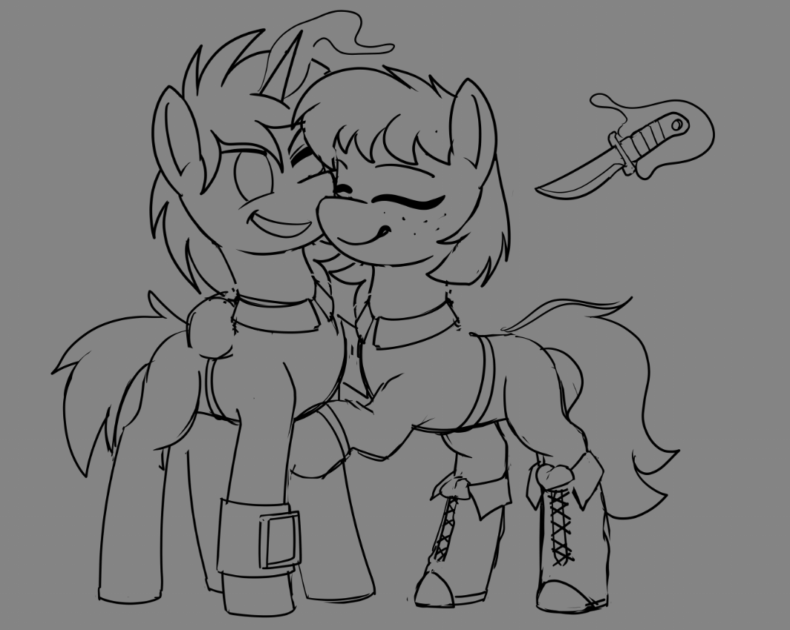
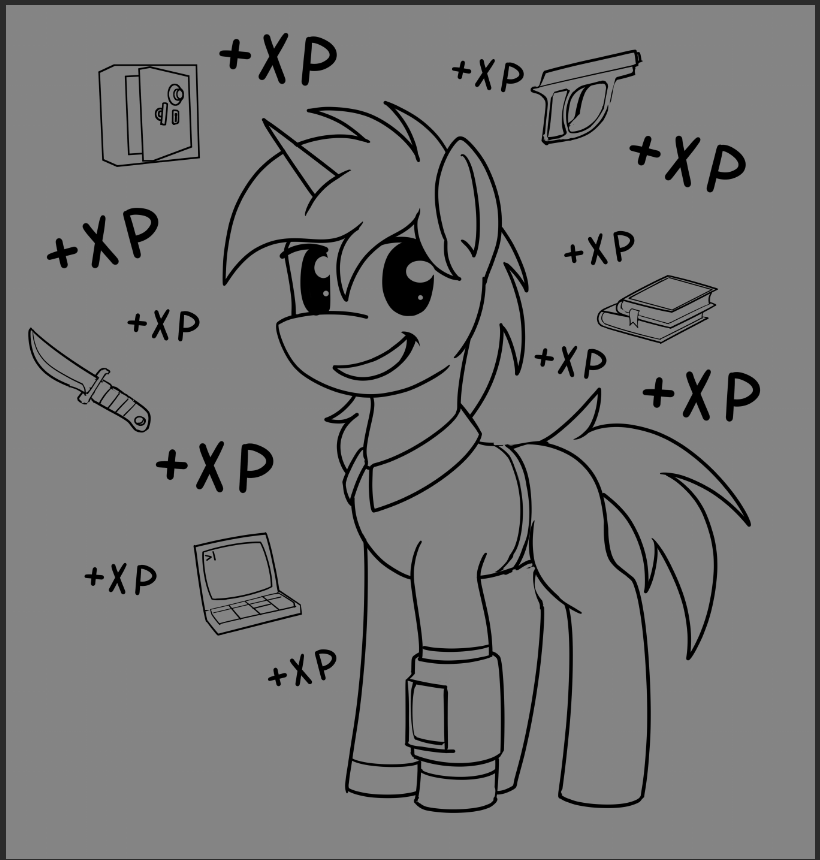

# Новости

## Мы делаем свою первую публичную презентацию!
Начинаем с крутых новостей: мы делаем презентацию на эвенте [Littlepip's Little Party](https://lplp.pony.style/), который пройдёт 20 апреля!
Поговорим про текущий прогресс, историю проекта, будущие обновления, включая сюжетное демо «Стойло 55», а так же разные весёлые истории из разработки.
Для тех кто знает английский будет трансляция (надеюсь), а запись с субтитрами можно будет посмотреть на youtube позже.

## Частота обновлений
До текущего момента мы пытались поддерживать частоту обновлений на одном в месяц. Но суровая реальность такова что у нас нет ресурсов сделать за месяц значительное количество изменений.
Из-за этого большинство из вас просто не трогало новые версии, и это ожидаемо - в них просто недостаточно нового и интересного чтобы этого того стоило.  

С этого момента мы решили изменить стратегию: теперь новые версии будут выходить только когда накопится достаточно новых фич. Или, другими словами, обновление будет только когда мы посчитаем
что его достаточно, чтобы наверняка захватить ваше внимание.
Мы целимся на раз в 3 месяца, но в зависимости от прогресса обновление может выйти раньше или позже.

С этим изменением, мы анонсируем что **новая версия выйдет 20го апреля,** в тот же день что и презентация.

## Доступ инсайдером
Чтобы компенсировать более долгое ожидание, мы открываем доступ к dev билдам самым активным и заинтересованным участникам сообщества.
Так же, инсайдеры получат доступ к каналам разработки, и смогут принимать участие в обсуждении (если хотят).

# Превьюшки

## Быстрый лут
Теперь можно не останавливаться чтобы лутать ящики:
<iframe width="560" height="315" src="https://www.youtube.com/embed/-y_FZNEXB2o" title="YouTube video player" frameborder="0" allow="accelerometer; autoplay; clipboard-write; encrypted-media; gyroscope; picture-in-picture; web-share" allowfullscreen></iframe>
Так же на фоне можно увидеть новый цикл дня и ночи.

## Случайные концепты

