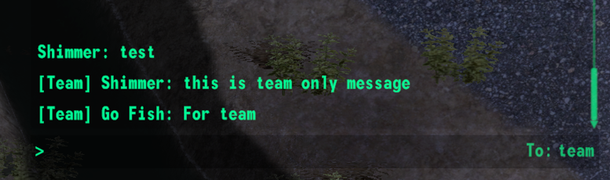

В январе работа была сосредоточена на не-публичных частях игры, поэтому новых фич о которых хочется рассказать отдельно
всего 3: новая механика стрельбы, Л.У.М, и чат.

Обновление уже доступно для загрузки в лаунчере ([**Windows**](https://github.com/Megaspell/MegaspellLauncher/releases/latest/download/Megaspell-Launcher-Installer.exe), [**Linux**](https://github.com/Megaspell/MegaspellLauncher/releases/latest/download/Megaspell-Launcher.AppImage)) или [напрямую](https://github.com/Megaspell/Megaspell-Releases).

# Прогресс за месяц

## Новая механика стрельбы

До этого было 2 типа снарядов: мгновенные лучи, и кинетические. Первые использовались для всех пуль и лазерных лучей, а
последние - для ракет и плазмы.  
Как показали тесты с реальными игроками, мгновенные пули это очень плохое решение: когда все пули гарантированно
попадут, из боя пропадает личный скилл.
Побеждает почти всегда тот кто напал первым. Бой сводился к "стой на месте и зажимай ЗПС".

Для решения этой проблемы мы добавили время полёта всем снарядам - даже лазерам. Последствия:

- Разные типы оружия теперь имеют более выраженные ниши. Из оружия с медленными снарядами труднее попадать на больших
  дистанциях.
- Снайперские винтовки теперь выгодно отличаются скоростью полёта снаряда, что позволяет попадать из них на максимальной
  дистанции. До этого с их целесообразностью были проблемы.
- Дробовики с пулями (вместо дроби) теперь не являются заменой дальнобойных винтовок 1к1 из-за медленной пули.
- В новой системе есть возможность менять скорость и размер снаряда прямо в полёте, а так же применять гравитацию.
  Пока что это особо не используется, но в будущем позволит добавить особое оружие вроде огнемёта.
- Видимые трассеры просто красивее ;)

<iframe width="560" height="315" src="https://www.youtube.com/embed/1jT5ZTprm3A" title="YouTube video player" frameborder="0" allow="accelerometer; autoplay; clipboard-write; encrypted-media; gyroscope; picture-in-picture; web-share" allowfullscreen></iframe>

## Локатор Ушки-на-Макушке (Л.У.М.)

Мы попробовали несколько разных вариантов для радара, и самым лучшим показался использовать края экрана для вывода меток
на ближайших NPC.

Есть отдельные метки для NPC в прямой видимости, за препятствием, и за пределами видимости.
Так же есть возможность выключить отображение меток союзников в настройках, для тех кто хочет более чистый HUD.

## Чат

Добавили чат для общения между игроками, с поддержкой отдельного канала для команды, и приватных сообщений.

Так же есть системные сообщения которые отсылаются сервером, но можно и самому: `broadcast "текст сообщения"` в
консоли (нужно быть админом).
В системных сообщениях есть поддержка форматирования
с [Rich Text](https://docs.unity3d.com/Packages/com.unity.ugui@1.0/manual/StyledText.html).

# Полный список изменений

## Исправления

- При переключении вертикальной синхронизации (V-Sync) меню настроек иногда съезжало.
  ПипБак указывал отрицательные значения веса при экипировке оружия и брони.
- "Показать цель задания на карте" при первом клике показывало расположение игрока.
- Было невозможно использовать Enter для подтверждения формы "Добавить сервер".
- Исправлены тени персонажей (которые оказывается никогда не работали).
- Исправлены анимации некоторого оружия (пусковая установка, отдача, и другое).
- Подсказка "начать разговор" не была переведена.

## Интерфейс

- Обновления заданий теперь отображаются на HUD справа-сверху.
- Введена система чата: включая системные, публичные, командные и приватные сообщения.
- В чат пишется о подключении/отключении и смене команды игрока.
- Теперь можно выйти из меню инвентаря нажав на клавишу ПипБака (Tab).
- Добавлен загрузочный экран при загрузке уровня. Игроки без SSD теперь не будут смотреть на чёрный экран.

## Игровой процесс

- Теперь все снаряды и пули обладают временем пролёта: почти мгновенное у лазеров, и ниже среднего у дробовиков.
- Двухстволка теперь может выстреливать по одному патрону за раз.

## Графика
- Новые визуальные эффекты для лазеров.

## Другое

- Добавлены команды `despawn` и `kill` для деспавна и убийства NPC.
- Обновлена локализация.
- Оптимизированы эффекты от попадания пуль.
- Логи от внутреннего сервера теперь можно увидеть в консоли на клиенте.
- Конфигурация наборов снаряжения в DM вынесена в датапаки.

# Планы на следующий месяц

- Продолжать выносить контент в датапаки.
- Добавить наконец настройки сложности. Важное замечание: это нужно не столько для самой "сложности", сколько для
  возможности подтюнить какие-то геймплейные аспекты прямо во время игры.
  Хочется сделать конфигурацию как в STALKER Anomaly, где можно настраивать каждый чих.
- Доделать закачку клиентом серверных датапаков, чтобы не нужно было ставить их на клиент вручную (другими словами
  сделать как в Garry's Mod).
- Уровни, получение опыта, очки распределения перков / навыков, разблокировка перков и прокачка навыков.