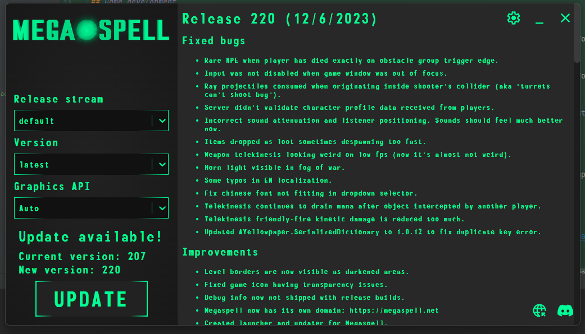

A little over a month has passed since the public announcement of Megaspell.
It was, to put it mildly, an eventful month for the team, as the announcement and release of the demo happened much earlier than planned.
A small unlisted teaser spread too much, it was impossible to remain silent and we hastily created infrastructure for announcement and demo.

# Month's progress

## Game development

### Added S.A.T.S.
<iframe width="560" height="315" src="https://www.youtube.com/embed/nD0IvXcoUqY?si=v8fQvyoxJ9f2vZ82" title="YouTube video player" frameborder="0" allow="accelerometer; autoplay; clipboard-write; encrypted-media; gyroscope; picture-in-picture; web-share" allowfullscreen></iframe>

### Added telekinesis
<iframe width="560" height="315" src="https://www.youtube.com/embed/P7VX1h5t1AE?si=eIDpyKB3LOkEhekq" title="YouTube video player" frameborder="0" allow="accelerometer; autoplay; clipboard-write; encrypted-media; gyroscope; picture-in-picture; web-share" allowfullscreen></iframe>

### New PipBuck 2100
A custom PipBuck model made by DeadAir has been added - with physical buttons, better UI tabs, and HP/MP crystal indicators.

### Public TDM demo
In crunch mode TDM and the Manehattan Suburbs map were finished. Despite the lack of content people liked it, and we received a lot of useful feedback.
Two patches were released with hundreds of bugs and changes, including a map rework (@not.kirill) and new weapons. Changelogs can be [found here](https://github.com/Megaspell/Megaspell-Releases/releases).

## Infrastructure

### Created public blog at [megaspell.net](https://megaspell.net)
By the way it is opensource ([GitHub](https://github.com/Megaspell/megaspell-blog)) and based on [RyanFitzgerald/devblog](https://github.com/RyanFitzgerald/devblog)

### Separate CI/CD infrastructure for Megaspell
Previously the project was hosted as part of my personal infrastructure, but now it is mostly separate. The website, Postgres, Prometheus, Grafana, and other little things were transferred.  
Now we can automatically publish builds on GitHub, including separation into dev and public streams. Release process only takes 10-15 minutes.

### Launcher and updater
A week was spent creating a launcher for the game. Unfortunately, the search for an opensource or cheap launcher did not give any results, so we created our own using
Electron and React. Spoiler: writing a launcher using unfamiliar tech, especially while being sick, is not an easy task.
The launcher is open source ([GitHub, MIT license](https://github.com/Megaspell/MegaspellLauncher)) and is very easy to adapt to other games/applications.
Main features:
- Download the game and updates directly from the GitHub CDN, which means the launcher will work even if our infrastructure is offline.
- There is a choice between installing the latest version and specific versions.
- Release streams: you can add a custom stream, such as beta or dev, or even modified builds. Private repositories are also supported.
- Selecting a graphics API to launch the game. Very useful for NVIDIA 2011-2013 GPUs, which report that they support Vulkan/DX12 but in fact only correctly work with DX11.

There are also plans to support incremental updates (only changes will be downloaded), and fixing broken installations.

# Future plans
We received a lot of feedback and data from the public TDM demo, and the focus of this month was processing and responding to feedback.
But for now we plan to focus almost entirely on developing a story mode demo - the Stable 55 arc.
Follow the updates on discord.

# Q/A

### Target platforms
Currently, there are builds for Windows and Linux. A build for macOS is also planned, but not in the near future. **Only 64-bit OS is supported**.

### Playable races
The game is tailored for a character with magic. There are no plans to add the ability to play as a pegasus or earth pony in the foreseeable future because:
- This will require adapting all gameplay mechanics and UI to a magicless character. And by “all” we mean REALLY ALL.
- It will be very difficult to make a pegasus, or even more so an earth pony, as compelling to play as a unicorn.

But this does not mean that the choice of visuals will be limited - nothing prevents us from adding zebras with a horn, earth ponies with a horn, and even pegasus, which cannot fly higher than a meter, with a horn. And also kirins, why not?

### Accessibility
We don't have the resources to make the game as accessible as Minecraft, but this is an important topic, and we will try to make the controls and UI as accessible as we can.
What we will definitely improve:
- Navigation in the UI using only the keyboard - things like confirmation/cancel on Y/N or Enter/ESC, navigation using arrows or Tab, etc.
- Ability to enter values into input elements like sliders directly.

### Patreon/Boosty/etc
There are no plans to accept monetary help. If you still want to help you can commission something from individual team members (@dev role in Discord).