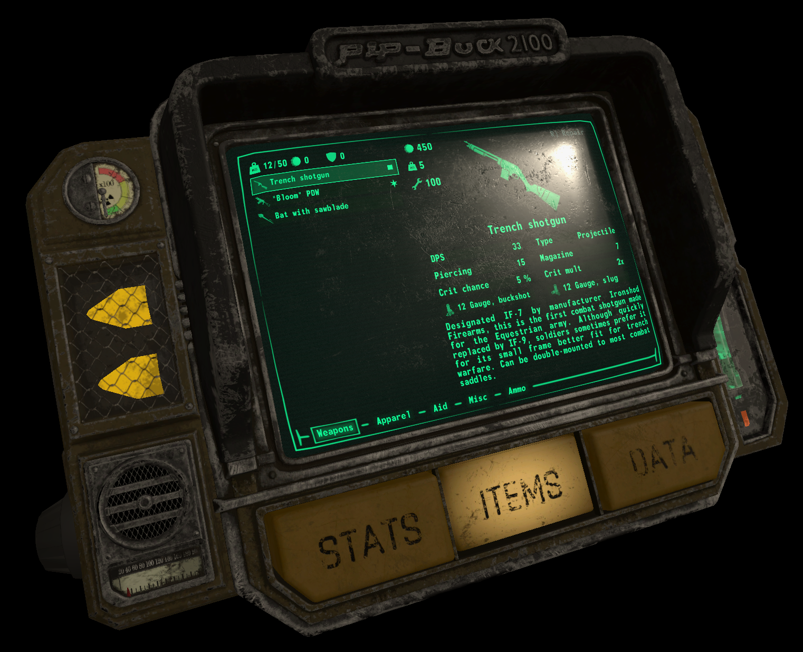
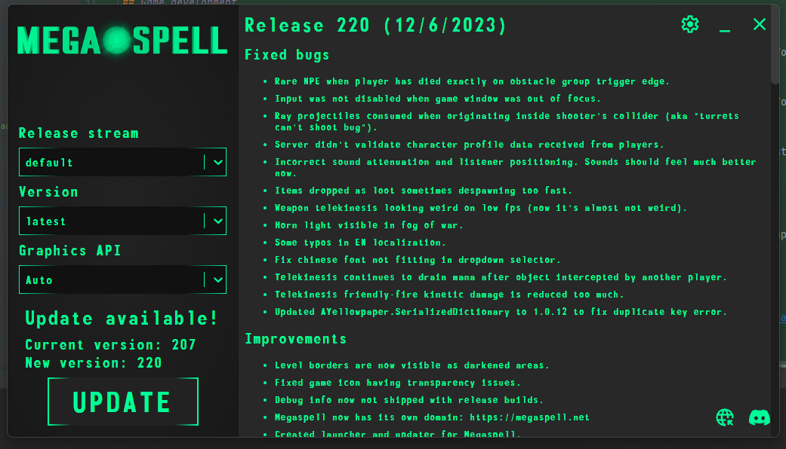

Прошло чуть больше месяца с публичного анонса Megaspell.
Для команды это был мягко говоря насыщенный событиями месяц, ведь анонс и релиз демо произошли значительно раньше запланированного.  
Вброс небольшого тизера доступного только по ссылке слишком сильно разнёсся, молчать было нельзя и в спешном порядке была поднята
необходимая инфраструктура.

# Что было сделано за месяц

## Разработка игры

### Добавлен З.П.С.
<iframe width="560" height="315" src="https://www.youtube.com/embed/nD0IvXcoUqY?si=v8fQvyoxJ9f2vZ82" title="YouTube video player" frameborder="0" allow="accelerometer; autoplay; clipboard-write; encrypted-media; gyroscope; picture-in-picture; web-share" allowfullscreen></iframe>

### Добавлен телекинез
<iframe width="560" height="315" src="https://www.youtube.com/embed/P7VX1h5t1AE?si=eIDpyKB3LOkEhekq" title="YouTube video player" frameborder="0" allow="accelerometer; autoplay; clipboard-write; encrypted-media; gyroscope; picture-in-picture; web-share" allowfullscreen></iframe>

### Новый PipBuck 2100
Была добавлена модель пипбака за авторством DeadAir - с физическими кнопками, более логичными вкладками UI, и индикацией ОЗ/ОМ на кристаллах.

### Демо с режимом TDM
В режиме кранча был доделан TDM и карта Пригород Мейнхэттена. Несмотря на (как мне казалось) малое количество контента людям зашло, и мы получили очень много полезного фидбэка.  
Было выпущено два патча с сотней багфиков и изменений, включая переделку карты (@not.kirill) и новое оружие. Списки изменений можно [прочитать тут](https://github.com/Megaspell/Megaspell-Releases/releases).

## Инфраструктура

### Поднят блог на [megaspell.net](https://megaspell.net)  
Если что, он опенсорсный ([GitHub](https://github.com/Megaspell/megaspell-blog)) и базируется на [RyanFitzgerald/devblog](https://github.com/RyanFitzgerald/devblog)  

### Отдельная инфра для Megaspell
Раньше проект хостился как часть личной инфры, но сейчас он по большей части отделён. Перенесены были сайт, Postgres, Prometheus, Grafana, и ещё по мелочи.  
Теперь мы можем автоматизированно собирать и публиковать билды на GitHub, включая разделение на dev и public потоки. От решения до релиза проходит всего 10-15 минут.

### Лаунчер
Неделя была потрачена на создание лаунчера для игры. К сожалению поиск опенсорсного или дешёвого лаунчера результатов не дал, поэтому я написал свой на
Electron и React. Спойлер: писать лаунчер на технологиях с которыми до этого не работал, ещё и с температурой 39, не очень лёгкое дело.  
Лаунчер опенсорсный ([GitHub, MIT license](https://github.com/Megaspell/MegaspellLauncher)) и его очень легко адаптировать под другие игры/приложения.
Основные фичи:
- Загрузка игры и обновлений напрямую с CDN GitHub, что значит лаунчер будет работать даже если наша инфра будет оффлайн.
- Есть выбор между установкой последней версии и конкретных версий.
- Релизные стримы: можно добавить кастомный стрим, например бета или dev, или даже модифицированные сборки. Так же поддерживаются приватные репозитории.
- Выбор графического API для запуска игры. Очень полезно для видеокарт NVIDIA 2011-2013, которые репортят что поддерживают Vulkan/DX12 но на самом деле нормально работают только с DX11.

Так же в планах есть поддержка инкрементальных обновлений (будут качаться только изменения), и починки сломанной установки.

# Дальнейшие планы
Мы получили очень много фидбека и данных от публичного демо TDM, и фокусом этого месяца была обработка и реагирование на фидбек.  
Но сейчас мы планируем почти полностью сфокусироваться на разработке сюжетного демо - арки Стойла 55.  
Следите за обновлениями в дискорде.  

# Ответы на популярные вопросы

### Целевые платформы
В данный момент есть билды под Windows и Linux. Так же планируется билд под macOS, но не в ближайшее время. **Поддерживаются только 64-битные ОС**.

### Играбельные расы
Игра заточена под игрока с магией. Добавлять возможность играть за пегаса или земнопони не планируется в обозримом будущем потому что:
- Это потребует адаптации всех механик под игрока без магии. И под "всех" имеется ввиду ВООБЩЕ ВСЕХ.
- Сделать пегаса или тем более земнопони таким же привлекательным для игры как единорога будет очень трудно.
  
Но это не значит, что косметический выбор будет ограничен - нам ничего не мешает добавить зебр с рогом, земнопони с рогом, и даже пегасов, которые не могут взлетать выше метра, с рогом. А так же киринов, почему нет?

### Доступность
У нас нет ресурсов сделать игру такой же доступной как например Minecraft, но это важная тема и мы будем стараться делать управление и UI доступным.  
Что мы обязательно улучшим:
- Навигация в UI используя только клавиатуру - это подтверждение/отмена на Y/N, навигация через стрелочки и Tab, итд.
- Возможность ввести значения в элементы ввода типа слайдеров напрямую.

### Поддержка донатом
Планов принимать донаты нет. Желающие помочь могут заказать личный коммишен у кого-нибудь из команды - смотрите профили людей с ролью @dev в нашем дискорде.